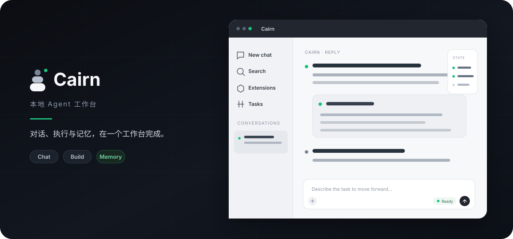
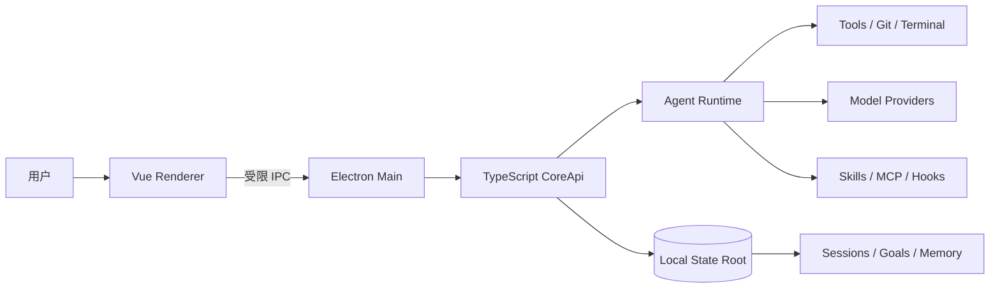

<div align="center">
  

  <h1>Cairn</h1>

  <p><strong>把任务交给本地 Agent，让上下文、工具和执行过程留在你的工作台。</strong></p>

  <p>
    面向个人开发者的桌面 Agent 工作台。<br />
    在一个可恢复、可审查、可控制的运行时中完成对话、代码修改、长期任务与记忆检索。
  </p>

  <p>
    <a href="https://github.com/m1iz/cairn/actions/workflows/ci.yml"></a>
    
    
    
  </p>

  <p>
    <a href="#快速开始">快速开始</a> ·
    <a href="#核心能力">核心能力</a> ·
    <a href="#系统架构">系统架构</a> ·
    <a href="#评测">评测</a> ·
    <a href="docs/README.md">完整文档</a>
  </p>
</div>



## 为什么是 Cairn

模型负责推理，Cairn 负责让一次 Agent 任务真正落地：保存会话状态、组织工作区上下文、调度工具、约束权限，并让中断后的任务能够继续。

| Local-first                          | 可控执行                                     | 持久上下文                   | 一体化工作台                            |
| :----------------------------------- | :------------------------------------------- | :--------------------------- | :-------------------------------------- |
| Core、会话、记忆和工具调度运行在本机 | 工具调用经过 schema、权限与 workspace policy | 会话、计划、目标与记忆可恢复 | 对话、Git、文件、终端和任务状态集中呈现 |

> **本地运行不等于完全离线。** 调用模型、网页搜索或远程 MCP 时，必要内容仍会发送到用户配置的外部服务。

## 核心能力

| 能力              | Cairn 如何实现                                                            |
| ----------------- | ------------------------------------------------------------------------- |
| **Chat / Build**  | 普通对话与绑定本地项目的工程任务使用不同上下文边界                        |
| **Agent Runtime** | 支持流式回复、工具调用、暂停确认、取消、恢复与 checkpoint                 |
| **Plan / Goal**   | 先规划再执行，或将长任务交给可持续推进的目标运行时                        |
| **本地工程工具**  | 在权限约束下读取和修改文件、执行命令、操作 Git、查看终端与 Review         |
| **扩展能力**      | 统一接入 Tools、Skills、Hooks、MCP、子代理与 Team 协作                    |
| **Hybrid Memory** | 融合 BM25、向量相似度、时间衰减与 MMR；支持记忆更新、删除和派生索引重建   |
| **模型适配**      | 管理 OpenAI / Anthropic 协议及兼容 Provider，不把运行时绑定到单一模型厂商 |
| **桌面自动化**    | Scheduler、后台任务和运行状态使用同一套权限与会话所有权模型               |

## 界面与工作流

Cairn 将主要工作流放进同一个桌面窗口：

1. 在 **Chat** 中讨论问题，或创建绑定目录的 **Build** 会话。
2. Agent 读取项目规则与上下文，按当前权限模式规划并调用工具。
3. 文件、Git、Terminal、Plan、Goal 和运行状态在工作区侧栏中持续可见。
4. 会话中断或应用重启后，从本地权威状态恢复，而不是依赖界面中的临时数据。

进一步了解：[Chat 与 Build](docs/user/chat-build.md) · [Plan 与 Goal](docs/user/plan-goal.md) · [工具与扩展](docs/user/tools-skills-mcp.md)

## 快速开始

### 环境要求

- Node.js 22 或更高版本
- npm 与 Git
- 一个可用的模型 Provider、API Base 和 API Key

当前仓库尚未提供公开安装包，请从源码启动开发版：

```bash
git clone https://github.com/m1iz/cairn.git
cd cairn

npm ci
npm --prefix desktop ci
npm --prefix desktop run dev
```

应用启动后，进入 **设置 → 模型** 添加 Provider，保存并测试连接，然后新建 Chat 或 Build 会话。完整步骤见[首次使用](docs/user/getting-started.md)。

### 构建桌面应用

```bash
npm run build
npm --prefix desktop run package:verify
```

Windows 安装包可在本地使用以下命令生成：

```bash
npm --prefix desktop run dist:win
```

## 系统架构



Renderer 不直接持有本机权限。Electron Main 对 IPC 操作重新授权，Core 负责输入校验、领域服务组合、工具权限与持久状态；默认私有数据根为 `~/.cairn`。

详细设计见[架构总览](docs/architecture/overview.md)与[控制和权限](docs/architecture/control-and-permissions.md)。

## 评测

Cairn 将功能正确性与 Agent 效果分开衡量，避免把局部实验写成完整排行榜成绩。

| 评测                      | 范围                                  |                               结果 |
| ------------------------- | ------------------------------------- | ---------------------------------: |
| **SWE-bench Verified**    | 固定 27 题子集，使用官方验证器        |      **20 / 27 resolved（74.1%）** |
| **LongMemEval-S**         | 官方 cleaned 500 题、每题官方候选会话 |                    **Hit@1 89.0%** |
| **LongMemEval-S**         | 同上                                  | **Recall@5 94.53% · MRR@5 93.09%** |
| **Hybrid Memory latency** | 同一 500 题检索运行                   |                   **P95 74.14 ms** |

在该 LongMemEval-S 设置中，Cairn Hybrid 相比纯向量检索的 Hit@1 提升 **4.4 个百分点**，相比 BM25 提升 **4.0 个百分点**。该结果衡量的是官方每题候选会话上的检索能力，不代表在任意规模全局记忆库中的准确率。

评测入口和复现约束见 [`config/hybrid-memory/README.md`](config/hybrid-memory/README.md)。公开数据与 embedding 缓存不会写入仓库。

## 开发与质量检查

```bash
# Core 与 Desktop 测试
npm test
npm --prefix desktop test

# 静态检查与构建
npm run typecheck
npm run format:check
npm run build
```

GitHub Actions 会在 Windows 与 Ubuntu 上执行格式门禁、文档边界检查、类型检查、Lint、测试和桌面构建；Windows 还会验证原生终端与打包后的应用 smoke test。

## 文档导航

| 我想了解                       | 文档                                                       |
| ------------------------------ | ---------------------------------------------------------- |
| 第一次安装、配置模型和创建会话 | [首次使用](docs/user/getting-started.md)                   |
| 会话、项目与本地数据如何保存   | [模型、记忆与附件](docs/user/models-memory-attachments.md) |
| Tools、Skills 与 MCP 如何接入  | [工具与扩展能力](docs/user/tools-skills-mcp.md)            |
| Scheduler、Team 与 Hooks       | [自动化与协作](docs/user/automation-collaboration.md)      |
| 系统分层和一次请求的完整链路   | [架构总览](docs/architecture/overview.md)                  |
| 修改、测试或扩展 Cairn         | [开发指南](docs/development/README.md)                     |
| 启动、模型、数据或打包问题     | [诊断与排障](docs/user/diagnostics-troubleshooting.md)     |

## 项目状态

Cairn 目前处于个人开发与 Preview 阶段，产品主线是 TypeScript / Electron 桌面应用。公开安装包、稳定版兼容承诺与开源许可证尚未发布；如需体验，请从源码构建并自行配置模型服务。

<div align="center">
  <sub>Built for deliberate, local-first agent workflows.</sub>
</div>
